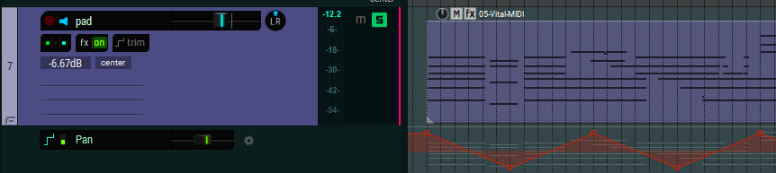
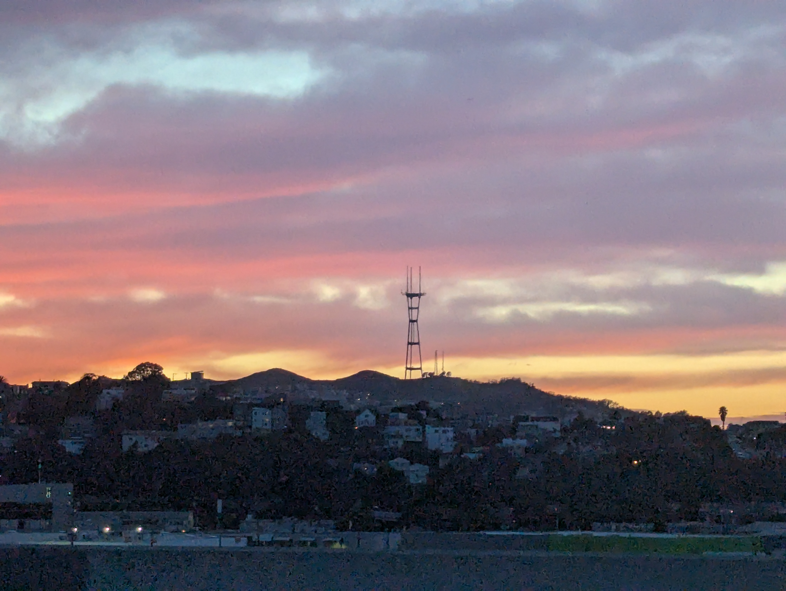
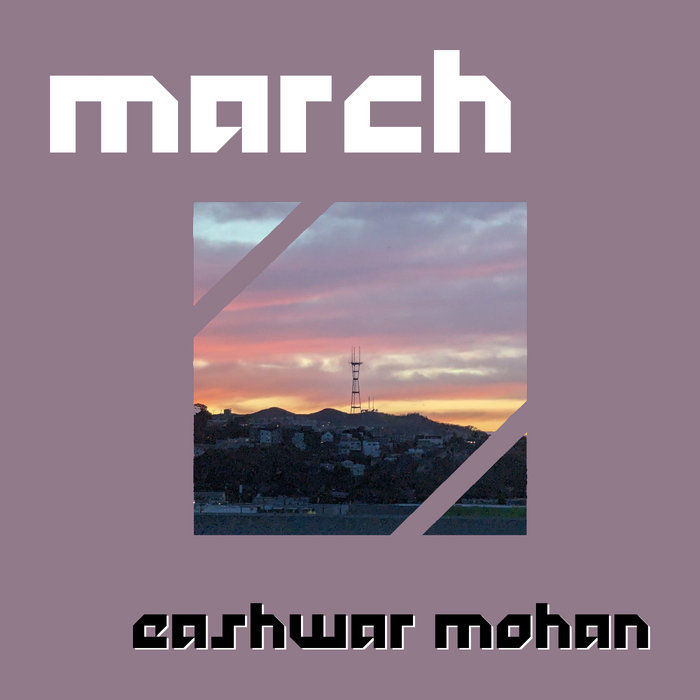
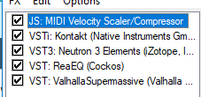
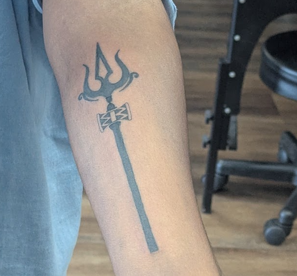
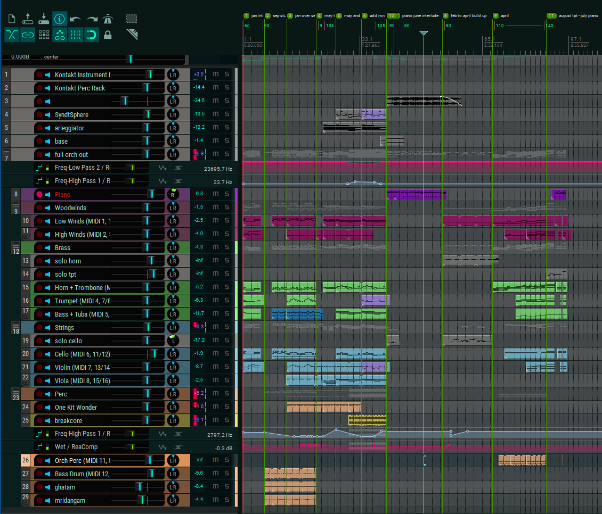

in my [last post](2025-postmortem-01), i reflected on one of my two major art projects in 2025, which was to learn art from scratch by drawing daily.

the other project i mentioned was the challenge to also release one track of music a month!

now, unlike visual art, i would claim a pretty decent amount of experience as an instrumentalist, composer and producer. my credentials: as of 2026, i've been playing the piano for 20 years; the bass clarinet for 15; i started composing and doing music production 10 years ago, and in college i spent a significant amount of time studying and specializing in the field of game audio/video game music.

you can listen to my full discography of music i've made across the past 10 years on [my bandcamp](http://music.eash.dev/music)! if you want to hear some of the stuff i'm most proud of prior to this year's project, i'd suggest [endless reverie](https://music.eash.dev/album/endless-reverie) -- the jrpg-inspired soundtrack i wrote across 3 years for a jrpg-inspired d&d campaign.

## why did i decide to do this project?

i had a few motivations for starting this project:

- the past few years, all of the music projects i'd worked on had been collaborative projects with friends and colleagues: the aforementioned [d&d campaign](https://music.eash.dev/album/endless-reverie), scoring [an audio play](https://music.eash.dev/album/the-cyberrats-radio-hour-original-score) and [its sequel](https://music.eash.dev/album/cyberrats-radio-hour-episode-2-original-score), and a [game jam at work](https://music.eash.dev/album/democracy-bus-original-soundtrack). i really wanted to work on some sort of project just for myself.
- i had absolutely no idea how the daily drawing project was gonna affect my creative juices -- whether it would be motivating, or demotivating, or maybe some of both? especially given that it was a brand new artistic medium to me, i wanted to give myself structured time to create art in a medium i already felt comfortable in.
- i wanted a project that could justify me having an eclectic collection of music in random genres and styles -- and the idea of a musical time capsule with each track representing the particular month of the year took shape pretty early on, with the idea being i can choose a different style to capture how i'm feeling.

so, 2025 started and it was time to get started on this project. how did it go? what did i learn? what did it all mean, in the end? in this post i kind-of want to chat a bit about the tunes, a bit about the overall process i followed, and my reflections on art as a form of self expression and journaling as it relates to both the music discussed here and the drawing project i talked about in the last post.

## january

let's talk about the first one first.

<iframe style="border: 0; width: 100%; height: 42px;" src="https://bandcamp.com/EmbeddedPlayer/album=1899089399/size=small/bgcol=3d566c/linkcol=2ec3c0/track=3542141741/transparent=true/" seamless><a href="https://eashwar.bandcamp.com/album/25">&#39;25 by eashwar</a></iframe>

okay so january was chaos. going back to work. navigating getting [into the groove of this new drawing habit](2025-postmortem-01#the-start-of-it). i was dealing with some other things as well, but all-in-all it was a bit overwhelming -- and as i sat down to start noodling on my keyboard for musical ideas, an idea formed around the idea of a looping melody in a weird time signature. something off kilter, repetitive, nervousness inducing; something that never truly lets you settle down. you notice yourself breathing manually.

sounds like cerebral instrumental prog to me!

and so the writing process began. i recently had acquired a copy of some [getgood drums](https://ggd.co/) so i was kinda off to the races!

the addition of chiptune and this synth pad that was constantly panning between left and right ear both aided in adding some disorientation/clash by way of stylistic incoherency and also like, the physical illusion of stereo going back and forth.

it was good fun! and an interesting/unique exercise to write in this time signature/for guitar while not being a guitarist at all. i hope this sounds like a demo track you might find from someone like Animals As Leaders (lol).

## february

<iframe style="border: 0; width: 100%; height: 42px;" src="https://bandcamp.com/EmbeddedPlayer/album=1899089399/size=small/bgcol=3d566c/linkcol=2ec3c0/track=3075847345/transparent=true/" seamless><a href="https://eashwar.bandcamp.com/album/25">&#39;25 by eashwar</a></iframe>
not only is february the month of valentines day, early feb happens to be when my anniversary with my significant other falls, so i'd kinda set up the month to make me feel very full of love the whole month.

i also really wanted to try recreating something like the sound found in kendrick lamar's [unreleased track for gnx](https://youtu.be/D7liwdjvhWc) (shown first when he announced the album, and second during the super bowl halftime show in 2025 -- also something from early feb.)

i hope the two inspirations come through pretty clearly!

## march

<iframe style="border: 0; width: 100%; height: 42px;" src="https://bandcamp.com/EmbeddedPlayer/album=1899089399/size=small/bgcol=3d566c/linkcol=2ec3c0/track=4255175290/transparent=true/" seamless><a href="https://eashwar.bandcamp.com/album/25">&#39;25 by eashwar</a></iframe>

i don't know what qualifies something to be a part of the "breakcore" subgenre outside of significant reliance on some form of the [amen break](https://en.wikipedia.org/wiki/Amen_break), but i think i got somewhere in that dnb subgenre or hopefully one of the ones surrounding it.

i think this might be one of the most broadly appealing of the tracks that i wrote, after the may track, but i also really like how tightly every part of this song clicks together precisely. i think the ambient synth components also add this atmosphere/evoke the idea of the month rushing past you, like you're on a highway with the window down. (the photograph that turned into the album art for this was taken in such a scenario this month.)

| | |
|---|---|
|  |  |

## april

<iframe style="border: 0; width: 100%; height: 42px;" src="https://bandcamp.com/EmbeddedPlayer/album=1899089399/size=small/bgcol=ffffff/linkcol=2ec3c0/track=1431811878/transparent=true/" seamless><a href="https://eashwar.bandcamp.com/album/25">&#39;25 by eashwar</a></iframe>

i took my family on a trip to yosemite this month. it was mind-blowing at this time of year, with a perfectly clear blue sky and some phenominal views of el cap and bridalveil falls.

the chaos of planning and executing on a vacation for my whole family, combined with the absolute joy of the trip itself, inspired me to try something along the lines of trailer music -- something brief, grandiose, over-the-top, with some sort of feeling like a call to action.

how to achieve this? 

- big power chords (and the [Mario cadence](https://en.wikipedia.org/wiki/Backdoor_progression#cite_note-3:~:text=This%20is%20also%20commonly%20known%20as%20a%20%22Mario%20Cadence%22.) -- maybe more specifically an homage to its usage in [Final Fantasy's Prelude motif](https://finalfantasy.fandom.com/wiki/Prelude_(theme)) especially since I do the whole IV-V-bVI-bVII-I fakeout resolution into it)
- full orchestra
- the A-B-A' song structure, basically the shortest way to musically storytell the monomyth.

the ending with the big gong crash as the final chord progression plays honestly gives me goosebumps, if i let myself say so. it's probably the reason i chose it to be the way that the december track resolves as well!

this was really fun to write, probably the style most in my wheelhouse already.

one of my friends remarked:

> this gives me the vibes of like. the trailer that plays after a while when you idle on the title screen of an RPG

so i don't think i did half bad!

## may

<iframe style="border: 0; width: 100%; height: 42px;" src="https://bandcamp.com/EmbeddedPlayer/album=1899089399/size=small/bgcol=ffffff/linkcol=2ec3c0/track=232270005/transparent=true/" seamless><a href="https://eashwar.bandcamp.com/album/25">&#39;25 by eashwar</a></iframe>

the other genre/style i was already quite well suited to writing, given my history with poking at it [[1]](https://eashwar.bandcamp.com/album/xenoblade-chronicles-chill-covers)[[2]](https://eashwar.bandcamp.com/track/the-next-fi), was the "lofi hip-hop beats" genre, if you can even call it a coherent style. this month i was spending a lot of time studying both [art](2025-postmortem-01#hitting-200) and for the coding interview gauntlet i was going through as part of applying to a new job. i'd, inevitably, been putting on a ton of these beats, getting distracted and harrumphing to myself "i could do that". so i let those voices win, and did that.

the fun challenge of this month, though, was using the aforementioned virtual metal drumkit sound like it absolutely is not one of those! engineering these drums into sounding like a sample that's been stretched and squashed and processed was a great challenge and a ton of fun.

i also chose to go with the rain sounds rather than the classic vinyl crackle of these formulaic tracks, given the weather during the month.

## june

<iframe style="border: 0; width: 100%; height: 42px;" src="https://bandcamp.com/EmbeddedPlayer/album=1899089399/size=small/bgcol=ffffff/linkcol=2ec3c0/track=2693234139/transparent=true/" seamless><a href="https://eashwar.bandcamp.com/album/25">&#39;25 by eashwar</a></iframe>

in june, i played *deltarune chapters 3 & 4*, and was also swept up in the chaotic, fun, messy festivities of both receiving and accepting a job offer, in addition to helping plan the pride month festivities at my then-current (soon-to-be-ex-)employer. and as those who know me well are quite aware, i'm a massive fan of the xenoblade chronicles series and especially their soundtracks. particularly up there for me is the [battle theme from xenoblade chronicles 2: torna ~ the golden country](https://youtu.be/1weNnjzaXbY). this all served as inspiration to me as i started writing music for the month.

it was also at this month that i realized i'd already unintentionally been writing each track of the year in a different tonal center -- and i figured, well, there are 12 notes in the western chromatic scale, and 12 months! so from this month onward i committed to choosing a different one of the 12 chromatic notes as either the tonic of the key or the tonic of the relative major key (e.g. C major and A minor counted as the same key.)

i think this track is the one i struggled with the most; i honestly think that the first half of the track is very weak! (i like the second half better). i very heavily studied the drums of the xenoblade battle themes (and deltarune battle themes) i'd grown to love and tried to write something similar. i don't think i did too great. my continued resistance to keep using the same metal drumkit lent me negative favors in this track, but i decided that it was too late to try porting it to anything else, and as a result i had to accept it'd just kinda sound like this.

outside of this, i do think of this as fast, electric, and energizing, and it does pull itself together towards the end. i'd love to revisit this style of track (rhythm section heavy jazz stuff) and especially learn more about convincing jazz drumming with virtual instruments.

looking back on it now, i actually think it came out pretty dang okay despite it all.

## july

<iframe style="border: 0; width: 100%; height: 42px;" src="https://bandcamp.com/EmbeddedPlayer/album=1899089399/size=small/bgcol=ffffff/linkcol=2ec3c0/track=221298994/transparent=true/" seamless><a href="https://eashwar.bandcamp.com/album/25">&#39;25 by eashwar</a></iframe>

i think this is the strongest track i wrote for the whole year, by a non-insignificant margin. not to say that i don't overall like the other tracks, but i really think this is my strongest musical writing and the most emotionally conveyant track.

i left my job of 4 years, took a trip to europe, and began the process of moving to a new apartment, all in the same month. i turned the piano on and meditated on my favorite "bittersweet" chord progression, the I-iv progression.

i think that's where i'd leave my discussion of this track. the song itself can do the rest of the talking.

## august

<iframe style="border: 0; width: 100%; height: 42px;" src="https://bandcamp.com/EmbeddedPlayer/album=1899089399/size=small/bgcol=ffffff/linkcol=2ec3c0/track=1106540432/transparent=true/" seamless><a href="https://eashwar.bandcamp.com/album/25">&#39;25 by eashwar</a></iframe>

this is probably in my top 3 of tracks this year, if only because of how outside of my comfort zone i pushed myself to! i was really craving the idea of writing something in the style of 80's jazz pop, especially japanese city pop. a month of new beginnings and the peak of summer seemed exactly like the right month for this.

i wrote out some really nonsense lyrics, downloaded a sample for a seed shaker, found a free bongo vst, and set off to the races. the chord progression of the verse is really a classic you will see on a lot of songs in this era, 36251: iii7, vi7, II7, V7, I7. it's a quintessential jazz and gospel progression.

for the chorus, i returned to the same progression i used last month, the I-iv (major 1 to minor 4). this enabled me to tap a little bit into that floaty, nostalgic vibe again (hence "up in the clouds" in the lyrics here!)

i've never really recorded my voice singing anything more than a demo track, and i don't really consider myself to be a talented singer in any capacity, but i realized it was too late to hire a friend and i certainly didn't want to use any text-to-speech tools, so i bit the bullet and sang my heart out on this track. this is on the lower end of my range, and i think if i wrote another thing i sing for i'd pick something a bit more comfortable to me.

and i'm proud to say i didn't have to figure out autotune (i have no idea what software to purchase and use, if you have any tips let me know, haha).

## september

<iframe style="border: 0; width: 100%; height: 42px;" src="https://bandcamp.com/EmbeddedPlayer/album=1899089399/size=small/bgcol=ffffff/linkcol=2ec3c0/track=828283721/transparent=true/" seamless><a href="https://eashwar.bandcamp.com/album/25">&#39;25 by eashwar</a></iframe>

in september i got my first tattoo:

it had me feeling relatively devotional, and i spent a good amount of time this month listening to hindu devotional music. especially with [navaratri going on](https://en.wikipedia.org/wiki/Navaratri#Tamil_Nadu) and september 30th being the saraswati puja, i felt particularly inspired to dive a little into writing in this style.

i picked a [carnatic rāgam](https://en.wikipedia.org/wiki/Svadhya) that particularly struck inspiration in me and broke out the virtual mridangam and ghatam.

and as a tribute to indian rock fusion, i brought back this year's champion vst, my getgood drumkit. doing a metal groove with the carnatic percussion on top of it was absolutely a bop and kept me going. i had fun improvising on top of this groove + drone.

## october

<iframe style="border: 0; width: 100%; height: 42px;" src="https://bandcamp.com/EmbeddedPlayer/album=1899089399/size=small/bgcol=ffffff/linkcol=2ec3c0/track=616483245/transparent=true/" seamless><a href="https://eashwar.bandcamp.com/album/25">&#39;25 by eashwar</a></iframe>

october was a little bit of a cold month for me emotionally. i was pretty exhausted, feeling lonely, but i had pockets of joy (like visiting michigan and florida for a little bit).

i don't know what compelled me to write something weird, ambient, with this combination of acoustic instruments and synth layers. something about it also being spooky month

i also recorded the bass clarinet part that's one of the two instrument solos in this song! i'd been meaning to properly get back to this the solo cello is virtual.

i had a lot of fun engineering the synths and bleeps and bloops on this track, and doing the mixing/mastering was really delightful.

## november

<iframe style="border: 0; width: 100%; height: 42px;" src="https://bandcamp.com/EmbeddedPlayer/album=1899089399/size=small/bgcol=ffffff/linkcol=2ec3c0/track=3959113826/transparent=true/" seamless><a href="https://eashwar.bandcamp.com/album/25">&#39;25 by eashwar</a></iframe>

november constituted the month i spent a lot of time playing [*hollow knight: silksong*](https://christopherlarkin.bandcamp.com/album/hollow-knight-silksong-original-soundtrack). i also was reslitening this fall/winter to the [homestuck soundtracks](https://homestuck.bandcamp.com/).

hopefully the title name fits into place here. i'm not sure i have something super introspective to say about this track; i did a "variations on a theme" vibe and wrote a bunch of different styles of the same melodic content.

## december

<iframe style="border: 0; width: 100%; height: 42px;" src="https://bandcamp.com/EmbeddedPlayer/album=1899089399/size=small/bgcol=ffffff/linkcol=2ec3c0/track=1529324920/transparent=true/" seamless><a href="https://eashwar.bandcamp.com/album/25">&#39;25 by eashwar</a></iframe>

i think i knew by the time the month of august hit that i wanted the final month to be a mashup track of the first 11 tracks. i thought that the challenge of this track was much more heavily on the compositional side than the production/mixing/mastering side -- but it ended up being extremely heavy on both fronts!

this track starts, as it should, with the january melody tracked to 4/4, leading into september's percussion, and a rewrite of january's melody to be able to act as a countermelody to september's melody.

having a slower metal groove on top of the carnatic percussion has much heavier spy movie vibes when the accompanying melodic instruments are all western orchestral instruments.

pivoting into the repeated background motif of the lo-fi hip hop tune from may, the downwards arpeggiating synth from october makes an appearance as the brass play a slow, dirge-like version of the melody for march (the breakcore one!) -- and as you register that, the amen break sample comes in with a massive amount of compression/eq on all instruments alongside it, with higher instruments playing the slower version of the november motif.

this culminates with the drums cutting out as a solo cello concludes on the finishing notes of october.

just as the month of july in the middle of the year was a solo piano, the middle of this track too was a solo piano, but this time an interpretation of the jazzy battle theme from june.

from there, a low brass, winds and cello section tributes february's warm and loving chords, before taking us home, building up the triumphant progression of april's trailer music.

holding on that final massive major chord, a solo trumpet player screams the chorus of the august city pop track, and a piano plays the ending notes of july, with one final repeat of that chord to close us out.

it took every fibre of my being to not add an applause sound effect fading out at the end of the track once the final note hits.

i took the approach to mixing/mastering this the way i approach all bigger orchestral compositions like this: i start by adjusting panning and volume in stereo space as if instruments are placed on a realistic, standard orchestral seating chart. there are many of these and many people are opinionated about them, but broadly the strings surround the conductor the closest, and then the brass and woodwinds are in a row behind, with various pieces of percussion in the back alongside the grand piano. the double basses and the tubas are ensured to be seated next to each other, while the remaining brass sits in increasing pitch next to the tuba. the woodwinds fare similarly, with bassoon bass clarinet hopefully next to the tubas and basses.

once i adjust the left/right pan and volume according to that chart, i then go through and apply reverb to the ensemble. instruments sitting further back in an auditorium definitely get more echoey due to distance to the audience and more bouncing off the back wall of the auditorium before the audience hears it.

finally, i make EQ adjustments and listen to the song in as many listening environments as possible. my studio monitors, 2 different pairs of wired headphones, 1 pair of wireless, my phone speakers, and my car speakers. each and every listen gave me more tweaks and changes to hone in onto the track with, adjusting volumes, tempos, timings, instrumentation, and also, of course, EQ curves on each track.

wow. truly a triumphant moment to stand at the end of this track and see a full year of work poured into every detail of the whole album. what fun! but how do i feel, hmm?

## what does it all mean?

i reflected [in the last post](2025-postmortem-01#overall-reflections-and-learning) about how drawing every day made me more in tune with my surroundings, more mindful, and more appreciative of the beauty of everything around me.

if the visual art project of the year made me more outwardly aware, i'd say the music project of the year made me more inwardly aware. i felt like i gave myself a reason every month to ask myself, "how do i feel this month? what are the major emotions of the month? how could i convey these emotions to other people?"

and this exercise gave me an outlet to try and process and consolidate my emotions into a medium i find a bit easier to communicate with than words.

as i lurk in the beginnings of 2026, i realize that i am much more aware of my emotional state and needs than i was at the start of last year, just the same as my awareness of my surroundings improved by art.

and i think i've made beautiful progress towards improving at the kind of self expression that unlocks and enables a richer, deeper, more thoughtful future for my art this year, be it visual, auditory, or words.

that's special, i think! to know ones art better is to know oneself better, too.

## so... what's next?

more music, that's for sure. at least 5 finished pieces, across the various solo and collaborative projects i have lined up this year.

more art, as i discussed in the last post, too.

but generally, i think, more self confidence, more joy, and more thoughtful engagement and presence in the events of my life, is all i really hope to have in 2026.

thanks for reading and reflecting with me! i am excited to share this space with you and am excited to write and share more in the coming year.

take care!